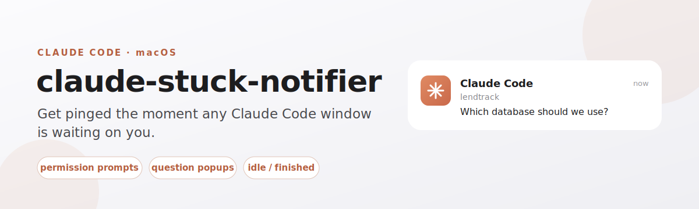
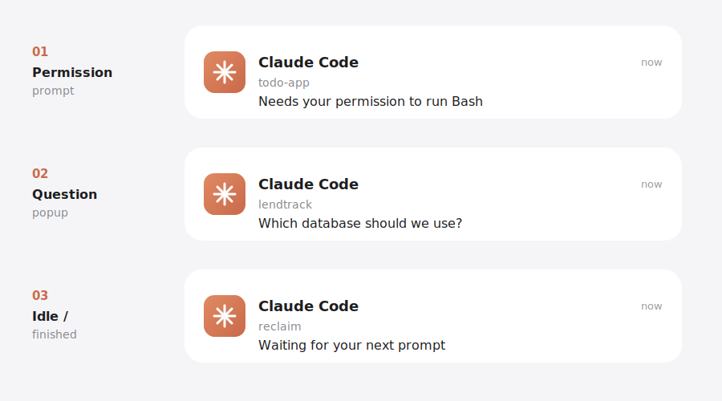
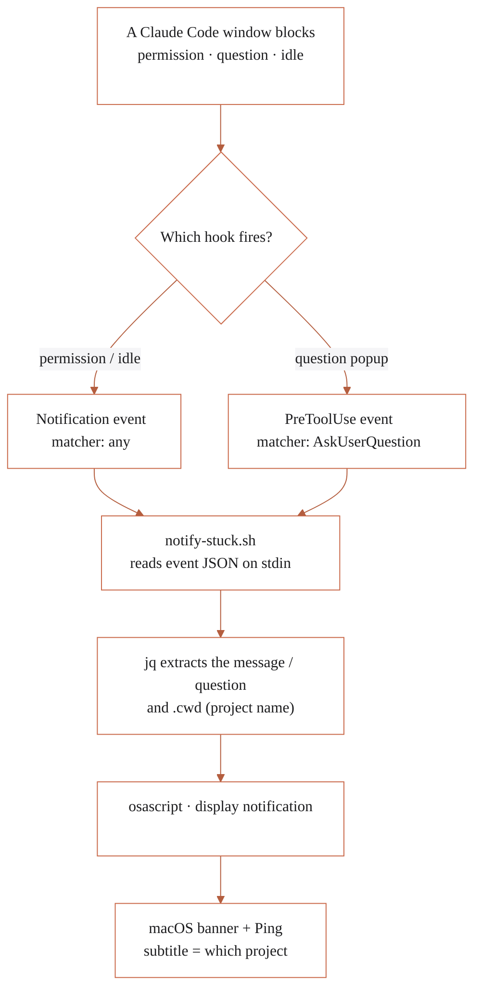

<p align="center">
  
</p>

<p align="center">
  
  
  
  
</p>

Run several Claude Code windows at once and one of them quietly blocks on a
permission prompt or a question — you notice ten minutes later. **claude-stuck-notifier**
fires a macOS banner (with sound) the instant *any* window needs you, and the
banner tells you **which project** is waiting.

---

## Install

```bash
curl -fsSL https://raw.githubusercontent.com/gokulmc/claude-stuck-notifier/main/install.sh | bash
```

Then **reload your open Claude Code windows** so they pick up the hooks.

> **Requirements:** macOS (uses `osascript`) and [`jq`](https://jqlang.github.io/jq/) — `brew install jq`.

---

## See it in action

Every state that leaves a window waiting produces a banner. The **title** is
always `Claude Code`, the **subtitle** is the project folder (so you know which
window), and the **body** is the actual prompt — for a question popup, it shows
the real question text.

<p align="center">
  
</p>

| # | Trigger | Banner body |
|---|---------|-------------|
| 01 | Permission / tool-approval prompt | Claude's permission message |
| 02 | `AskUserQuestion` popup | the actual question text |
| 03 | Idle / finished, waiting for you | `Waiting for your answer` |

---

## How it works

Claude Code emits [hook events](https://code.claude.com/docs/en/hooks) at
lifecycle points and passes JSON on stdin. The installer wires two of them to a
tiny shell script that reads the JSON with `jq` and calls `osascript`. The hooks
are **notify-only** — they never block or change what Claude does.



The two hooks:

| Hook | Matcher | Fires when |
|------|---------|-----------|
| `Notification` | *(any)* | Claude needs permission, or is idle/finished and waiting |
| `PreToolUse` | `AskUserQuestion` | Claude opens a question popup |

---

## What the installer does

It is safe to re-run — it **backs up** `settings.json` and merges
**idempotently and non-destructively**, so your existing `permissions`, `model`,
and any other hooks are untouched. Running it twice never creates duplicates.

```mermaid
%%{init: {'theme':'base','themeVariables':{'primaryColor':'#FFFFFF','primaryTextColor':'#1D1D1F','primaryBorderColor':'#C9694A','lineColor':'#B45E3F','secondaryColor':'#F5F5F7','fontFamily':'-apple-system, Helvetica, Arial, sans-serif'}}}%%
flowchart LR
  A["curl … &#124; bash"] --> B{"macOS? jq present?"}
  B -->|no| X["exit with a hint<br/>e.g. brew install jq"]
  B -->|yes| C["install<br/>notify-stuck.sh"]
  C --> D["back up settings.json<br/>→ .bak.timestamp"]
  D --> E["jq merge the two hooks<br/>idempotent · non-destructive"]
  E --> F["enabled"]
```



---

## Uninstall

```bash
bash uninstall.sh
```

Backs up settings, removes only this tool's hooks, and deletes the hook script.

---

## Repo layout

```
claude-stuck-notifier/
├── README.md
├── install.sh              # curl | bash entry point
├── uninstall.sh            # cleanly reverses it
├── assets/                 # README artwork (SVG)
└── hooks/
    └── notify-stuck.sh     # the notifier (single source of truth)
```

---

## Troubleshooting

- **No banner appears?** Enable notifications for the delivering app (your
  terminal / VS Code / Script Editor) in **System Settings → Notifications**,
  and make sure **Focus / Do Not Disturb** isn't suppressing them. macOS can also
  suppress a banner attributed to the app that is currently frontmost.
- **Delivered but you didn't see it?** Banners auto-dismiss quickly; check
  **Notification Center** (click the clock) — the notification will be listed
  there.
- **Wrong project name?** The subtitle uses the hook's `.cwd`; if a window
  reports an unexpected folder, that's the directory Claude was launched in.

---

## Notes

- macOS-only for now (osascript). Linux (`notify-send`) could be added behind a
  `uname` branch.
- Zero runtime services — it's just two hooks and a 20-line shell script. Nothing
  runs except when Claude actually needs you.
