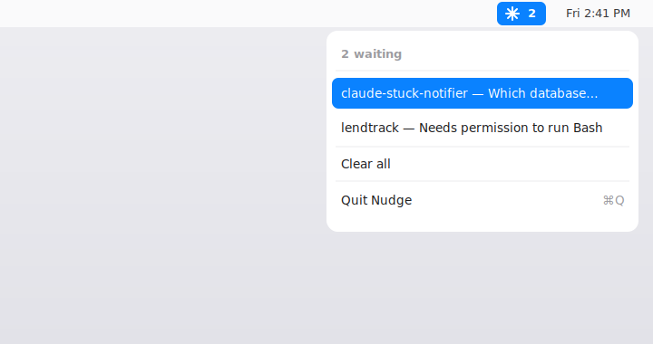

# Nudge

A tiny macOS **menu-bar app** that upgrades `claude-stuck-notifier` from a plain
banner to a **clickable** one: click the notification (or a menu item) and it
jumps you to the VS Code window of the Claude session that's waiting.

<p align="center">
  
</p>

## Why an app?

`osascript`/`terminal-notifier` can't do click-to-open on modern macOS — they use
the deprecated `NSUserNotification` API, which still posts banners but no longer
routes the **click** back. The modern **`UNUserNotificationCenter`** API does
deliver clicks, but it requires a real, signed `.app` bundle. Nudge is that
bundle. (Verified working on macOS 26.3.1, where terminal-notifier's click
callback is dead.)

## What it does

- Menu-bar **✱ sparkle** with a count of Claude windows currently waiting.
- Posts a native banner (branded coral-spark icon, project name as subtitle,
  the question / permission message as body).
- **Click the banner or a menu item** → runs VS Code's bundled `code <cwd>` to
  focus that project's window and fronts VS Code.
- De-dupes by project, `Clear all`, `Quit`, and a "notifications disabled → open
  Settings" shortcut if permission was denied.

Focus is **window-level**, and depends on whether the session has a folder:

| Session | Result on click |
|---------|-----------------|
| Has a project folder | `code <folder>` focuses that exact window — even with many windows open |
| Folder-less (launched from home / no workspace) | just brings VS Code to the front; there's no folder to target |
| Several folder-less windows at once | can't be told apart (identical empty titles) — best effort is fronting VS Code |

macOS also exposes no way to select a specific editor *tab* within a window.

## Build & install

Requires Xcode command-line tools (Swift). From this folder:

```bash
./install.sh
```

This builds and signs `Nudge.app`, installs it to `/Applications`, and adds a
LaunchAgent so it starts at login (and stays alive to catch clicks). Grant the
one-time notification permission when prompted.

Once installed, `hooks/notify-stuck.sh` auto-detects `/Applications/Nudge.app`
and routes banners through Nudge; without it, the hook falls back to a plain
`osascript` banner.

`./build.sh` alone just produces `Nudge.app` in this folder. Override the signing
identity with `SIGN_ID="Your Identity" ./build.sh` (default: the first local
`*LocalSign` identity, for signature stability so the notification grant sticks).

## Manual test

```bash
open "nudge://notify?title=Claude%20Code&subtitle=myproject&message=Which%20DB%3F&cwd=$HOME/path/to/project"
```

A banner appears; clicking it focuses `myproject` in VS Code.

## Uninstall

```bash
launchctl unload ~/Library/LaunchAgents/com.gokulmc.nudge.plist
rm -f ~/Library/LaunchAgents/com.gokulmc.nudge.plist
rm -rf /Applications/Nudge.app
```

(The shell tool keeps working with plain banners afterward.)

## How it works

`Info.plist` registers the `nudge://` URL scheme; the hook fires
`open "nudge://notify?…&cwd=…"`; the running app receives it via
`application(_:open:)`, posts a `UNUserNotificationCenter` notification carrying
`cwd`, and on click resolves the `code` CLI through
`NSWorkspace.urlForApplication(withBundleIdentifier: "com.microsoft.VSCode")` to
focus the right window. Single-file AppKit source in `Sources/main.swift`.
